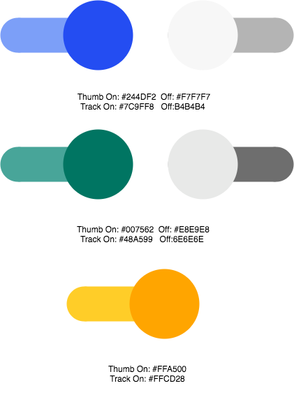
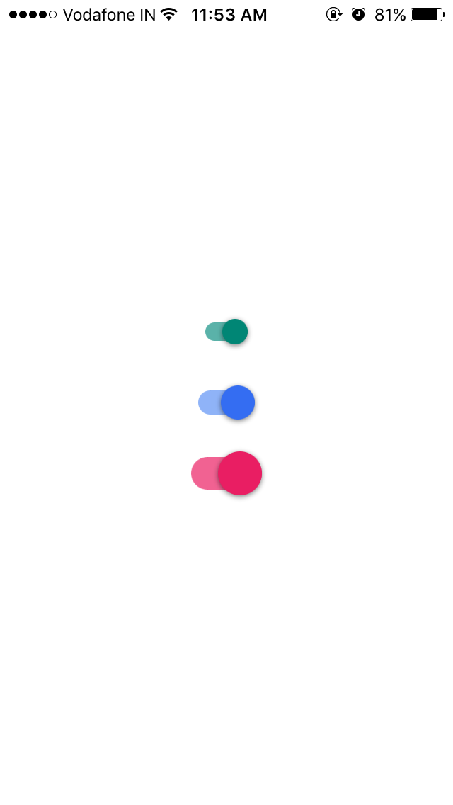

# MJMaterialSwitch


## Overview


`MJMaterialSwitch` is google's material design like switch UI with animation features.

This library has cool and sophisticated animations, ripple effect and bounce effect. Also, customizable properties can be tweaked behaviors and enhance your application UI cool.

With this library, you can easily implement material design switch to your app. 

<br/>

<br/>

## Usage

The simplest setup:

```Swift 
let androidSwitchSmall = MJMaterialSwitch(withSize: .small, style: MJMaterialSwitchStyle.light, state: MJMaterialSwitchState.on)
self.androidSwitchSmall.delegate = self
self.view.addSubview(self.androidSwitchSmall)
```

This is the simplest and easiest initialization. 
The style, size and initial state of `MJMaterialSwitch` instance is set to all default value as shown below.

### Customize Behaviors
MJMaterialSwitch has many prateters to customize behaviors as you like.

#### Style and size
```
//MARK: - Switch type
public enum MJMaterialSwitchStyle {
    case light, dark, medium
}

//MARK: - Initial MJMaterialSwitch size (big, normal, small)
public enum MJMaterialSwitchSize {
    case big, normal, small
}
```
 
 

 

## Author
Jaleel Nazir <nazirjaleel@gmail.com>

## License
MJMaterialSwitch is available under the MIT license.
